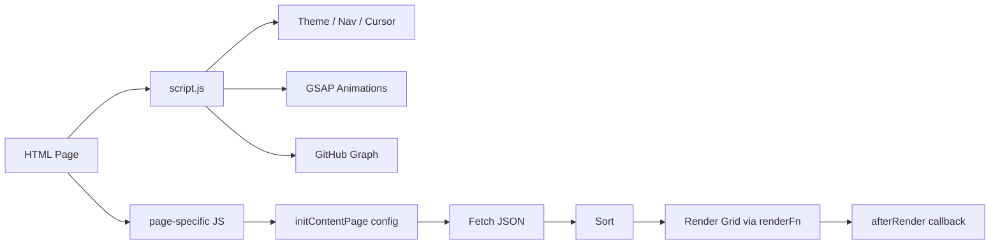

# rainier-ps.github.io — Architecture & Codebase Documentation

## Overview

A static portfolio website for Rainier Pearson Saputra, hosted on **GitHub Pages** at `https://rainier-ps.github.io/`. Built entirely with vanilla HTML, CSS, and JavaScript — no frameworks, no build tools.

The site serves as a personal portfolio showcasing projects, awards, publications, interactive labs, and a terminal-style interface.

---

## Site Map

| Page | File | Purpose |
|------|------|---------|
| Home | `index.html` | Landing page with hero, about, experience, skills, project/award carousels, contact |
| Projects | `projects.html` | Full grid view of all projects with sorting |
| Publications | `publications.html` | Full grid view of publications with sorting |
| Awards | `awards.html` | Full grid view of awards with sorting and image lightbox |
| Labs | `labs.html` | Interactive pixel art sandbox + GitHub contributions graph |
| Terminal | `terminal.html` | CLI-themed interactive terminal emulator |

---

## Project Structure

```
/
├── index.html              # Home page
├── awards.html             # Awards page
├── labs.html               # Labs page (pixel art + GitHub graph)
├── projects.html           # Projects page
├── publications.html       # Publications page
├── terminal.html           # Terminal emulator page
├── robots.txt              # Search engine crawl instructions
├── sitemap.xml             # XML sitemap for SEO
├── README.md               # Quick-start readme
│
├── css/
│   ├── styles.css          # Global styles (theming, layout, components, page grids)
│   ├── labs.css            # Pixel art sandbox styling
│   └── terminal.css        # Terminal page styling
│
├── js/
│   ├── script.js           # Global script (shared logic, animations, carousel, GitHub graph)
│   ├── awards.js           # Awards page: card renderer, delegates to initContentPage()
│   ├── labs.js             # Pixel art canvas sandbox
│   ├── projects.js         # Projects page: card renderer, delegates to initContentPage()
│   ├── publications.js     # Publications page: card renderer, delegates to initContentPage()
│   └── terminal.js         # Terminal emulator: commands, boot sequence
│
├── data/
│   ├── awards.json         # Award entries (title, description, image, date)
│   ├── projects.json       # Project entries (title, description, image, tags, links, date)
│   └── publications.json   # Publication entries (title, description, url, icon, tags, date)
│
├── images/
│   ├── site/               # Site branding assets (logo variants, avatar, favicon)
│   └── certificates/       # Award certificate images (AVIF format)
│
└── docs/
    └── architecture.md     # This documentation file
```

---

## Architecture & Data Flow

### Static Site, No Backend

The site is fully static — all content is fetched client-side from JSON files at runtime. There is no server, database, or API except:

1. **GitHub Contributions API** — `github-contributions-api.jogruber.de` for contribution graph data
2. **CDNs** — `cdnjs.cloudflare.com` (GSAP), `unpkg.com` (Lucide icons), `fonts.googleapis.com` (fonts)

### Data Loading Pattern

Each content page follows a consistent pattern via the shared `initContentPage()` function in `script.js`:

1. Page loads → `script.js` executes global setup (theme, cursor, nav, animations)
2. Page-specific JS calls `initContentPage()` with a config object (grid ID, data URL, render function)
3. JSON is fetched from local path first (`data/projects.json`), with a fallback to the raw GitHub URL
4. Data is sorted by user-selected sort option
5. Cards/items are rendered into a grid via `document.createDocumentFragment()`
6. After-render callback binds lightbox or other post-render logic



---

## Theming System

### CSS Custom Properties

The site uses a **CSS custom property theming system**. All color values are defined in `:root` for dark mode and overridden in `[data-theme="light"]`.

Key theme variables:

| Variable | Dark | Light | Purpose |
|----------|------|-------|---------|
| `--bg` | `#0a0a0d` | `#f4f4f8` | Page background |
| `--text` | `#eeeef3` | `#0e0e14` | Primary text |
| `--text-muted` | `rgba(238,238,243,0.55)` | `rgba(14,14,20,0.58)` | Secondary text |
| `--surface` | `#1a1a22` | `#ffffff` | Card/container backgrounds |
| `--sb-thumb-start` | `#4dabf7` | `#007BFF` | Accent/primary color |
| `--border` | `rgba(255,255,255,0.07)` | `rgba(0,0,0,0.07)` | Subtle borders |
| `--link` | `#4dabf7` | `#007BFF` | Link color |

### Theme Toggle

The theme toggle in `script.js`:
- Reads `localStorage.getItem('theme')` on load, falls back to `prefers-color-scheme`
- Toggles via `document.documentElement.setAttribute('data-theme', next)`
- Uses the **View Transition API** (`document.startViewTransition`) for a smooth circle-wipe animation between themes

---

## Component Breakdown

### Navigation

- Fixed-position navbar that transforms into a "pill" style island when scrolled past 60px
- Mobile: hamburger menu with slide-down overlay
- Responsive breakpoint at 768px
- Active link highlighting via scroll position tracking

### Hero Section

- Animated entrance via GSAP timeline
- Typewriter effect for tagline
- Flip-card avatar (3D rotation on hover) with separate images per theme
- Gradient orbs that follow mouse movement
- Marquee rolling text beneath hero

### GitHub Contribution Graph

- Custom implementation (not embedding GitHub's iframe)
- Uses `github-contributions-api.jogruber.de/v4/{username}?y={year}`
- Renders a grid of color-coded cells per week
- Tooltip on hover with contribution count and date
- Year selector (dropdown on mobile, buttons on desktop)
- Touch support for mobile tap-to-see-tooltip

### Carousel

- Paginated horizontal carousel for projects/awards on the homepage
- 3 items per page on desktop, 1 on mobile
- Dots navigation with sliding window (max 5 dots on desktop, 3 on mobile)
- Touch/mouse swipe support
- Drag indicator (cursor changes to grab/grabbing)

### Pixel Art Sandbox (Labs)

- Canvas-based pixel art renderer
- Loads an SVG avatar, pixelates it, applies circular/square mask
- Real-time controls: speed, opacity, beam size, angle, pixel gap
- Animation effects: linear scan, radar sweep, spotlight, pulse, dynamic cycle
- Upload custom images, download pixel art as PNG
- Settings panel slides in from right

### Terminal Emulator

- Full command-line interface simulation
- Boot sequence with typing effect
- Commands: `help`, `about`, `ls`, `cat`, `echo`, `date`, `who`, `whoami`, `clear`, `history`, `exit`
- Command history with arrow key navigation
- Tab completion for file paths

### Lightbox

- Modal overlay for image preview
- Focus trap to keep keyboard navigation within the modal
- Close on backdrop click or Escape key
- "Open in New Tab" button
- Date badge display (awards/projects pages)
- Body scroll lock when open
- Returns focus to triggering element on close

---

## JavaScript Architecture

### script.js (Global)

Loaded on all pages with `defer`. Responsibilities:

| Module | Description |
|--------|-------------|
| Theme toggle | View-transition-aware dark/light switching |
| Custom cursor | GSAP-powered cursor + ring follower |
| Nav scroll | Scroll-aware nav pill transformation |
| Nav mobile | Hamburger menu, outside-click close, Escape key |
| Email obfuscation | XOR-encoded email decryption on interaction |
| Hero animation | GSAP timeline + typewriter |
| Orb parallax | Mouse-following gradient orbs |
| Marquee | Infinite-scrolling text marquee |
| Scroll reveals | GSAP ScrollTrigger entry animations |
| Content page logic | `initContentPage()`, `renderContentGrid()` — shared data loading & rendering |
| Home carousel | Data loading, rendering, carousel logic |
| Lightbox | Global lightbox with focus trap |
| Back-to-top | Smooth scroll to top |
| Custom scrollbar | Draggable custom scrollbar |
| GitHub graph | Contribution grid renderer |
| Shared utilities | `SORT_OPTIONS`, `SORTERS`, `parseDateMs`, `formatDate`, `initSortUI`, `sortData`, `DEMO_ICON`, `GITHUB_ICON` |

### Page-specific Scripts

Each page-specific script is minimal (~30-55 lines), containing only:
- A `DOMContentLoaded` listener calling `initContentPage()` with a config object
- A render function (`renderAwardCard`, `renderProjectCard`, `renderPubCard`)

The common fetch → sort → render → callback pattern is handled by the shared `initContentPage()` function, eliminating code duplication.

---

## Styling Architecture

### styles.css (~1250 lines)

The main stylesheet containing all global and page-specific styles:

- **Variables** — Design tokens for both themes
- **Reset** — Box-sizing, margin, padding
- **Typography** — Font families, sizes, weights
- **Layout** — Container, sections, grids
- **Components** — Nav, hero, cards, buttons, carousel, footer
- **Page grids** — Project grid, award grid, publication grid, loader
- **Effects** — Gradient orbs, noise overlay, marquee
- **Interactive** — Custom cursor, scrollbar, tooltips
- **Responsive** — Multi-breakpoint media queries (480, 640, 768, 1024px)
- **Accessibility** — Skip link, focus-visible, reduced motion

### Page-specific Stylesheets

| File | Used by | Purpose | Size |
|------|---------|---------|------|
| `labs.css` | labs.html | Pixel art canvas, control panel, toolbar | ~350 lines |
| `terminal.css` | terminal.html | Terminal layout, colors, help tables | ~160 lines |

### Key Design Patterns

- **Glassmorphism** — `backdrop-filter: blur() saturate()` on nav island, lightbox buttons
- **Card hover** — Subtle lift (`translateY(-4px)`) + border highlight
- **Button morph** — CTA button with slide-up pseudo-element background fill
- **Gradient orbs** — Large radial gradients that follow the mouse
- **Noise overlay** — Fixed SVG fractal noise at 2.5% opacity

---

## Performance Considerations

### Current Optimizations

- **AVIF images** — All certificate images use AVIF format
- **Lazy loading** — Images in carousels/grids use `loading="lazy" decoding="async"`
- **Passive events** — Scroll/touch event listeners use `{ passive: true }` where possible
- **Reduced motion** — `@media (prefers-reduced-motion: reduce)` resets all animations
- **Font display** — Google Fonts loaded with `display=swap`
- **GSAP optimized** — `force3D: true`, `ignoreMobileResize: true`

### Known Improvement Areas

- **Image dimensions** — Missing explicit `width`/`height` on some images causes CLS
- **Font loading** — 9 total font weights loaded, many unused
- **SRI** — No subresource integrity on CDN scripts

---

## Accessibility Features

### Implemented

- Skip link to main content (WCAG 2.4.1)
- ARIA labels on interactive controls (WCAG 4.1.2)
- Focus-visible outlines (WCAG 2.4.7)
- `aria-hidden="true"` on decorative elements (WCAG 1.1.1)
- `prefers-reduced-motion` media query (WCAG 2.3.3)
- Semantic HTML landmarks (`<nav>`, `<main>`, `<footer>`, `<section>`)
- Heading structure with `aria-labelledby`
- Lightbox focus trap (WCAG 2.1.2)
- Email obfuscation for spam prevention

### Known Gaps

- Carousel keyboard navigation: No arrow key support for slides
- Color contrast: Some muted text may fail WCAG AA

---

## Data Formats

### awards.json

```json
[
  {
    "title": "Award Name",
    "description": "Medal/Rank details",
    "image": "/images/certificates/file.avif",
    "date": "2025-01-01"
  }
]
```

### projects.json

```json
[
  {
    "title": "Project Name",
    "description": "Short description",
    "image": "https://.../thumbnail.avif",
    "tags": ["Tag1", "Tag2"],
    "demo": "https://...",
    "github": "https://...",
    "date": "2025-01-01"
  }
]
```

### publications.json

```json
[
  {
    "title": "Article Title",
    "description": "Short description",
    "url": "https://...",
    "icon": "lucide-icon-name",
    "tags": ["Tag1", "Tag2"],
    "date": "2025-01-01"
  }
]
```

---

## Security Measures

### Implemented

- Email obfuscation via XOR cipher in JavaScript
- `rel="noopener"` on all external links with `target="_blank"`
- Content-Security-Policy meta tag on all pages
- No tracking scripts, analytics, or third-party cookies
- All external resources use HTTPS

### Recommendations

- Add Subresource Integrity hashes to CDN scripts

---

## Hosting & Deployment

- **Host:** GitHub Pages (free, global CDN via Fastly)
- **Domain:** `rainier-ps.github.io` (GitHub-provided subdomain)
- **HTTPS:** Enforced by GitHub Pages with auto-renewing Let's Encrypt certificates
- **Deployment:** Push to `main` branch → automatic deployment

---

## Eco-Friendly Design Notes

- **Dark mode default** — Reduces power on OLED/AMOLED displays
- **AVIF images** — Industry-leading compression (50%+ smaller than JPEG)
- **No heavy frameworks** — Vanilla HTML/CSS/JS only
- **Minimal JavaScript** — ~35KB total across all scripts (unminified)
- **No tracking** — Zero analytics or marketing scripts
- **Lazy loading** — Below-fold images deferred

---

## Dependencies

| Library | Version | Size (min+gzip) | Purpose | Source |
|---------|---------|-----------------|---------|--------|
| GSAP | 3.12.5 | ~17KB | Scroll-triggered animations, timeline | cdnjs |
| GSAP ScrollTrigger | 3.12.5 | ~16KB | Scroll-based animation triggers | cdnjs |
| GSAP ScrollToPlugin | 3.12.5 | ~3KB | Smooth scroll-to-top | cdnjs |
| Lucide | 0.562.0 | ~7KB | SVG icon library | unpkg |
| Google Fonts | — | ~20KB+ | DM Sans + Space Grotesk | fonts.googleapis.com |

**Total third-party JS:** ~43KB gzipped | **Total CSS:** ~32KB unminified

---

## Build & Development

There is **no build step**. The site is pure static HTML/CSS/JS.

### Local Development

```bash
# Serve the project directory locally
python3 -m http.server 8000
# or
npx serve .
```

### Making Changes

1. Edit HTML/CSS/JS files directly
2. Refresh browser to see changes
3. Commit and push to `main` to deploy

### JSON Data Management

To add content, edit the relevant JSON file in `/data/`:
- Add a new object to the array
- Images should be in AVIF format and placed in `images/`
- Update `sitemap.xml` if adding new pages
