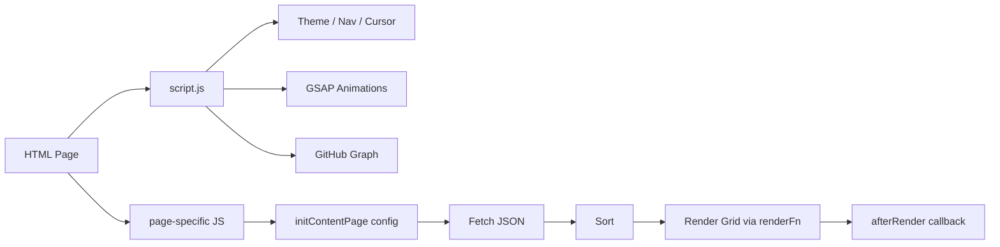

# rainier-ps.github.io - Architecture & Codebase Documentation

## Overview

A static portfolio website for Rainier Pearson Saputra, hosted on **GitHub Pages** at `https://rainier-ps.github.io/`. Built entirely with vanilla HTML, CSS, and JavaScript, with no frameworks and no build tools.

The site serves as a personal portfolio showcasing projects, awards, publications, interactive labs, and a terminal-style interface.

---

## Site Map

| Page | File | Purpose |
|------|------|---------|
| Home | `index.html` | Landing page with hero, about, experience, skills, project/award carousels, contact |
| Projects | `projects.html` | Full grid view of all projects with sorting |
| Publications | `publications.html` | Full grid view of publications with sorting |
| Awards | `awards.html` | Full grid view of awards with sorting and image lightbox |
| Labs | `labs.html` | Interactive pixel art sandbox + GitHub contributions graph |
| Terminal | `terminal.html` | CLI-themed interactive terminal emulator |

---

## Project Structure

```
/
├── index.html              # Home page
├── awards.html             # Awards page
├── labs.html               # Labs page (pixel art + GitHub graph)
├── projects.html           # Projects page
├── publications.html       # Publications page
├── terminal.html           # Terminal emulator page
├── robots.txt              # Search engine crawl instructions
├── sitemap.xml             # XML sitemap for SEO
├── README.md               # Quick-start readme
│
├── css/
│   ├── styles.css          # Global styles (theming, layout, components, page grids)
│   ├── labs.css            # Pixel art sandbox styling
│   └── terminal.css        # Terminal page styling
│
├── js/
│   ├── script.js           # Global script (shared logic, animations, carousel, GitHub graph)
│   ├── awards.js           # Awards page: card renderer, delegates to initContentPage()
│   ├── labs.js             # Pixel art canvas sandbox
│   ├── projects.js         # Projects page: card renderer, delegates to initContentPage()
│   ├── publications.js     # Publications page: card renderer, delegates to initContentPage()
│   └── terminal.js         # Terminal emulator: commands, boot sequence
│
├── data/
│   ├── awards.json         # Award entries (title, description, image, date)
│   ├── projects.json       # Project entries (title, description, image, tags, links, date)
│   └── publications.json   # Publication entries (title, description, url, icon, tags, date)
│
├── images/
│   ├── site/               # Site branding assets (logo variants, avatar, favicon)
│   └── certificates/       # Award certificate images (AVIF format)
│
└── docs/
    └── architecture.md     # This documentation file
```

---

## Architecture & Data Flow

### Static Site, No Backend

The site is fully static. All content is fetched client-side from JSON files at runtime. There is no server, database, or API except:

1. **GitHub Contributions API** - `github-contributions-api.jogruber.de` for contribution graph data
2. **CDNs** - `cdnjs.cloudflare.com` (GSAP), `unpkg.com` (Lucide icons), `fonts.googleapis.com` (fonts)

### Data Loading Pattern

Each content page follows a consistent pattern via the shared `initContentPage()` function in `script.js`:

1. Page loads → `script.js` executes global setup (theme, cursor, nav, animations)
2. Page-specific JS calls `initContentPage()` with a config object (grid ID, data URL, render function)
3. JSON is fetched from the local path first (`data/projects.json`), with a fallback to the raw GitHub URL
4. Data is sorted by user-selected sort option
5. Cards/items are rendered into a grid via `document.createDocumentFragment()`
6. After-render callback binds lightbox or other post-render logic

The homepage carousels use the same local-first, remote-fallback loading through the shared `loadJSON()` helper, so the page works even when external requests fail.


```mermaid
flowchart LR
    A[HTML Page] --> B[script.js]
    A --> C[page-specific JS]
    B --> D[Theme / Nav / Cursor]
    B --> E[GSAP Animations]
    B --> F[GitHub Graph]
    C --> G[initContentPage config]
    G --> H[Fetch JSON]
    H --> I[Sort]
    I --> J[Render Grid via renderFn]
    J --> K[afterRender callback]
```

---

## Theming System

### CSS Custom Properties

The site uses a **CSS custom property theming system**. All color values are defined in `:root` for dark mode and overridden in `[data-theme="light"]`.

Key theme variables:

| Variable | Dark | Light | Purpose |
|----------|------|-------|---------|
| `--bg` | `#0a0a0d` | `#f4f4f8` | Page background |
| `--text` | `#eeeef3` | `#0e0e14` | Primary text |
| `--text-muted` | `rgba(238,238,243,0.55)` | `rgba(14,14,20,0.58)` | Secondary text |
| `--surface` | `#1a1a22` | `#ffffff` | Card/container backgrounds |
| `--sb-thumb-start` | `#4dabf7` | `#007BFF` | Accent/primary color |
| `--border` | `rgba(255,255,255,0.07)` | `rgba(0,0,0,0.07)` | Subtle borders |
| `--link` | `#4dabf7` | `#007BFF` | Link color |

### Theme Toggle

The theme toggle in `script.js`:
- Reads `localStorage.getItem('theme')` on load (wrapped in try/catch for privacy modes), falls back to `prefers-color-scheme`
- Toggles via `document.documentElement.setAttribute('data-theme', next)`
- Uses the **View Transition API** (`document.startViewTransition`) for a smooth circle-wipe animation between themes, skipped when the user prefers reduced motion

### Motion Toggle and Settings Overlay

Motion preference in `script.js`:
- Animations are on by default. The only switch is `localStorage.motion` (`on`/`off`), so a visitor gets motion unless they explicitly turn it off
- The effective value is published as `<html data-motion="on|off">` before rendering so JavaScript and CSS stay in sync
- The nav button and the settings overlay store the new value and reload, so animations initialize through the same code paths as a first visit
- `storage` events apply changes from other tabs live: the attribute flips instantly, marquee, typing and cursor stop, armed ScrollTriggers are killed and their targets revealed, so content can never be left hidden
- The terminal writes the same key through `export MOTION=off`, so the terminal and the site share one setting

The settings overlay opens with `Ctrl + ,` on every script-enabled page. It is a `role="dialog"` panel with segmented controls for animations, theme and custom cursor, plus reset to defaults; focus is trapped while open, `Escape` closes it and focus returns to the trigger. The custom cursor preference lives in `localStorage.cursor` (off by default).

---

## Component Breakdown

### Navigation

- Fixed-position navbar that transforms into a "pill" style island when scrolled past 60px
- Mobile: hamburger menu with slide-down overlay
- Responsive breakpoint at 768px
- Active link highlighting via scroll position tracking

### Hero Section

- Animated entrance via GSAP timeline, or an instant static reveal when reduced motion is preferred
- Typewriter effect for tagline (static text under reduced motion)
- Flip-card avatar (3D rotation on hover) with separate images per theme
- Gradient orbs that follow mouse movement (skipped for touch devices and reduced motion)
- Marquee rolling text beneath hero, measured from the real three-set width so the loop never jumps

### GitHub Contribution Graph

- Custom implementation (not embedding GitHub's iframe)
- Uses `github-contributions-api.jogruber.de/v4/{username}?y={year}`
- Renders a grid of color-coded cells per week
- The calendar keeps a reserved `min-height` so content below never shifts while data loads
- After each render, `refreshLayout()` re-syncs ScrollTrigger positions and nav section offsets
- A sequence token prevents a slower year request from overwriting a newer selection
- Tooltip on hover with contribution count and date
- Year selector (dropdown on mobile, buttons on desktop)
- Touch support for mobile tap-to-see-tooltip

### Carousel

- Paginated horizontal carousel for projects/awards on the homepage
- 3 items per page on desktop, 1 on mobile
- Pages are separated by the same 20px gap used between cards, so a mid-transition row reads as one evenly spaced line
- Slide positions are computed from measured page offsets in pixels, so the track stays aligned at any viewport width
- Dots navigation with sliding window (max 5 dots on desktop, 3 on mobile)
- Touch/mouse swipe support with `touch-action: pan-y` so vertical scrolling stays native
- A `dragging` class disables card hover lifts while a drag is in flight
- Keyboard support: focus the carousel and use left/right arrow keys
- Drag indicator (cursor changes to grab/grabbing)

### Pixel Art Sandbox (Labs)

- Canvas-based pixel art renderer
- Loads an SVG avatar, pixelates it, applies circular/square mask
- Real-time controls: speed, opacity, beam size, angle, pixel gap
- Animation effects: linear scan, radar sweep, spotlight, pulse, dynamic cycle
- When the effect is set to none, the render loop idles instead of repainting every frame
- Upload custom images, download pixel art as PNG
- Settings panel slides in from right

### Terminal Emulator

- Bash-style interface on its own page, linked from the nav logo
- MOTD banner plus virtual filesystem under `/home/rainier`
- Commands: `help`, `about`, `ls`, `cd`, `pwd`, `cat`, `grep`, `head`, `tail`, `wc`, `sort`, `mkdir`, `touch`, `rm`, `echo`, `date`, `who`, `whoami`, `uname`, `hostname`, `id`, `uptime`, `free`, `df`, `ps`, `which`, `man`, `history`, `fastfetch`/`neofetch`, `sudo`, `export`, `env`, `printenv`, `unset`, `clear`, `exit`
- Environment variables via `export NAME=VALUE`; `export MOTION=off` writes `localStorage.motion` and syncs with the site in both directions
- Command history with Arrow Up/Down (bash `stepHistory` semantics), `history -c` to clear
- Tab completion: command names on the first word, file paths on the last token (fixed to operate on the last whitespace token so `cat about/bio` completes correctly)
- Readline keys: Ctrl+C cancels, Ctrl+L clears
- Virtual filesystem mutation (`mkdir`, `touch`, `rm`) works until reload; `rm /` is refused

### Contact and Resume

- Contact grid with GitHub, LinkedIn, Email, Instagram, Instructables and location cards
- The hero Resume chip and the contact-grid resume card are href-less anchors by default (coming-soon styling, not focusable); set `RESUME_PDF` in `script.js` to a relative PDF path (for example `files/resume.pdf`) and both become download links with no other changes

### Lightbox

- Modal overlay for image preview
- Focus trap to keep keyboard navigation within the modal
- Close on backdrop click or Escape key
- "Open in New Tab" button
- Date badge display (awards/projects pages)
- Body scroll lock when open
- Returns focus to triggering element on close

---

## JavaScript Architecture

### script.js (Global)

Loaded on all pages with `defer`. Responsibilities:

| Module | Description |
|--------|-------------|
| Library guard | If GSAP fails to load, a `no-anim` class reveals all content instead of leaving it hidden |
| Theme toggle | View-transition-aware dark/light switching with guarded localStorage |
| Motion toggle | Motion preference from `localStorage.motion` (on by default), published as `data-motion`, with nav button, settings overlay and live cross-tab sync |
| Settings overlay | `Ctrl + ,` dialog for animations, theme and custom cursor with focus trap and reset |
| Resume card | Reads `RESUME_PDF`; empty keeps the coming-soon card, a relative path turns it into a download link |
| Custom cursor | GSAP-powered cursor + ring follower, started on demand instead of a permanent rAF loop |
| Nav scroll | Scroll-aware nav pill transformation |
| Nav mobile | Hamburger menu, outside-click close, Escape key |
| Email obfuscation | XOR-encoded email decryption on interaction |
| Hero animation | GSAP timeline + typewriter, static under reduced motion |
| Orb parallax | Mouse-following gradient orbs |
| Marquee | Infinite-scrolling text marquee with real set-width measurement |
| Scroll reveals | GSAP ScrollTrigger entry animations using explicit `fromTo` end states |
| Content page logic | `initContentPage()`, `renderContentGrid()` - shared data loading & rendering |
| Home carousel | Local-first data loading, rendering, swipe/keyboard carousel logic |
| Lightbox | Global lightbox with focus trap |
| Back-to-top | Smooth scroll to top |
| Custom scrollbar | Draggable custom scrollbar |
| GitHub graph | Contribution grid renderer with layout refresh after each year render |
| Shared utilities | `SORT_OPTIONS`, `SORTERS`, `parseDateMs`, `formatDate`, `initSortUI`, `sortData`, `loadJSON`, `refreshLayout`, `DEMO_ICON`, `GITHUB_ICON` |

### Animation reliability

- Section headings are split into `.char` spans and animated with `gsap.fromTo()` so the end state is explicit. A `gsap.from()` + scrub combination can re-capture end values during a refresh and leave headings permanently invisible.
- `refreshLayout()` runs `ScrollTrigger.refresh()` plus `updateSectionTops()` after every asynchronous layout change (fonts ready, contributions render, carousel render, debounced resize).
- Motion follows `localStorage.motion` only: animations are on by default and the OS `prefers-reduced-motion` signal is not consulted. The effective value is written to `<html data-motion>` before any rendering, so JavaScript and CSS always agree. With motion off, text splitting and scroll animations are skipped and content is shown immediately, while the avatar flip card keeps its transition.
- The motion control appears in three linked places: the nav button, the `Ctrl + ,` settings overlay, and the terminal (`export MOTION=off`). All three write the same storage key and reload or apply live, so changing one changes the others.

### Page-specific Scripts

Each page-specific script is minimal (~30-55 lines), containing only:
- A `DOMContentLoaded` listener calling `initContentPage()` with a config object
- A render function (`renderAwardCard`, `renderProjectCard`, `renderPubCard`)

The common fetch → sort → render → callback pattern is handled by the shared `initContentPage()` function, eliminating code duplication.

---

## Styling Architecture

### styles.css (~1300 lines)

The main stylesheet containing all global and page-specific styles:

- **Variables** - Design tokens for both themes
- **Reset** - Box-sizing, margin, padding
- **Typography** - Font families, sizes, weights
- **Layout** - Container, sections, grids
- **Components** - Nav, hero, cards, buttons, carousel, footer
- **Page grids** - Project grid, award grid, publication grid, loader
- **Effects** - Gradient orbs, noise overlay, marquee
- **Interactive** - Custom cursor, scrollbar, tooltips
- **Responsive** - Multi-breakpoint media queries (480, 640, 768, 1024px)
- **Accessibility** - Skip link, focus-visible, reduced motion, `no-anim` fallback

Inline `style` attributes are avoided because the Content-Security-Policy blocks them; sizing such as `.proj-btn svg` lives in CSS instead.

### Page-specific Stylesheets

| File | Used by | Purpose | Size |
|------|---------|---------|------|
| `labs.css` | labs.html | Pixel art canvas, control panel, toolbar | ~410 lines |
| `terminal.css` | terminal.html | Terminal layout, colors, help tables | ~165 lines |

### Key Design Patterns

- **Glassmorphism** - `backdrop-filter: blur() saturate()` on nav island, lightbox buttons
- **Card hover** - Subtle lift (`translateY(-4px)`) + border highlight
- **Button morph** - CTA button with slide-up pseudo-element background fill
- **Gradient orbs** - Large radial gradients that follow the mouse
- **Noise overlay** - Fixed SVG fractal noise at 2.5% opacity (allowed in CSP via `img-src data:`)

---

## Performance Considerations

### Current Optimizations

- **AVIF images** - All certificate images use AVIF format
- **Lazy loading** - Images in carousels/grids use `loading="lazy" decoding="async"`
- **Passive events** - Scroll/touch event listeners use `{ passive: true }` where possible
- **Debounced resize** - Carousel re-renders only when the items-per-page breakpoint changes
- **Idle canvas** - The pixel art loop skips repaints while the effect is set to none
- **Reduced motion** - The blanket `animation-duration`/`transition-duration` override applies under `@media (prefers-reduced-motion: reduce)` only when `data-motion` is not `on`, plus a duplicate rule keyed on `data-motion="off"` so an explicit user opt-out works on motion-friendly systems. JavaScript skips animation setup whenever the effective preference is off.
- **Font display** - Google Fonts loaded with `display=swap`, with a `document.fonts.ready` refresh
- **GSAP optimized** - `ignoreMobileResize: true`, no permanent rAF loops when features are disabled
- **Unused libraries removed** - GSAP ScrollToPlugin and Lucide are only loaded on pages that use them

### Known Improvement Areas

- **Image dimensions** - Missing explicit `width`/`height` on some images causes CLS
- **Font loading** - 9 total font weights loaded, many unused

---

## Accessibility Features

### Implemented

- Skip link to main content (WCAG 2.4.1)
- ARIA labels on interactive controls (WCAG 4.1.2)
- `aria-roledescription="carousel"` with keyboard arrow-key slide navigation
- Focus-visible outlines (WCAG 2.4.7), including the carousel container
- `aria-hidden="true"` on decorative elements (WCAG 1.1.1)
- Animations are on by default and can be turned off from the nav button, the `Ctrl + ,` settings overlay or the terminal, persisted in `localStorage`; the OS reduced-motion signal is not auto-honored (WCAG 2.3.3 is AAA and this is a deliberate product choice documented under Known Gaps)
- Semantic HTML landmarks (`<nav>`, `<main>`, `<footer>`, `<section>`)
- Heading structure with `aria-labelledby`
- Lightbox focus trap (WCAG 2.1.2)
- Email obfuscation for spam prevention

### Known Gaps

- Contribution graph cells create many tab stops; arrow-key navigation inside the grid is not implemented
- Color contrast: Some muted text may fail WCAG AA
- The OS `prefers-reduced-motion` signal is ignored by default (deliberate site policy); visitors opt out through the toggle, overlay or terminal instead

---

## Data Formats

### awards.json

```json
[
  {
    "title": "Award Name",
    "description": "Medal/Rank details",
    "image": "/images/certificates/file.avif",
    "date": "2025-01-01"
  }
]
```

### projects.json

```json
[
  {
    "title": "Project Name",
    "description": "Short description",
    "image": "https://.../thumbnail.avif",
    "tags": ["Tag1", "Tag2"],
    "demo": "https://...",
    "github": "https://...",
    "date": "2025-01-01"
  }
]
```

### publications.json

```json
[
  {
    "title": "Article Title",
    "description": "Short description",
    "url": "https://...",
    "icon": "lucide-icon-name",
    "tags": ["Tag1", "Tag2"],
    "date": "2025-01-01"
  }
]
```

---

## Security Measures

### Implemented

- Email obfuscation via XOR cipher in JavaScript
- `rel="noopener"` on all external links with `target="_blank"`
- Content-Security-Policy meta tag on all pages, including `img-src data:` for the noise overlay
- Subresource Integrity (SHA-384) plus `crossorigin="anonymous"` on all CDN scripts
- No inline style attributes, so `style-src` can stay strict without `unsafe-inline`
- No tracking scripts, analytics, or third-party cookies
- All external resources use HTTPS
- Guarded `localStorage` access so privacy modes cannot break the page

---

## Hosting & Deployment

- **Host:** GitHub Pages (free, global CDN via Fastly)
- **Domain:** `rainier-ps.github.io` (GitHub-provided subdomain)
- **HTTPS:** Enforced by GitHub Pages with auto-renewing Let's Encrypt certificates
- **Deployment:** Push to `main` branch → automatic deployment

---

## Eco-Friendly Design Notes

- **Dark mode default** - Reduces power on OLED/AMOLED displays
- **AVIF images** - Industry-leading compression (50%+ smaller than JPEG)
- **No heavy frameworks** - Vanilla HTML/CSS/JS only
- **Minimal JavaScript** - ~79KB total across all scripts (unminified, ~10KB gzipped for the main script)
- **No tracking** - Zero analytics or marketing scripts
- **Lazy loading** - Below-fold images deferred
- **Page-specific CDN loads** - ScrollToPlugin removed, Lucide only where used
- **Idle-friendly loops** - Cursor and canvas render loops sleep when their feature is inactive

---

## Dependencies

| Library | Version | Size (min+gzip) | Purpose | Source |
|---------|---------|-----------------|---------|--------|
| GSAP | 3.12.5 | ~17KB | Scroll-triggered animations, timeline | cdnjs (SRI) |
| GSAP ScrollTrigger | 3.12.5 | ~16KB | Scroll-based animation triggers | cdnjs (SRI) |
| Lucide | 0.562.0 | ~7KB | SVG icon library (labs and publications pages only) | unpkg (SRI) |
| Google Fonts | - | ~20KB+ | DM Sans + Space Grotesk | fonts.googleapis.com |

**Total third-party JS:** ~40KB gzipped | **Total CSS:** ~55KB unminified

---

## Build & Development

There is **no build step**. The site is pure static HTML/CSS/JS.

### Local Development

```bash
# Serve the project directory locally
python3 -m http.server 8000
# or
npx serve .
```

### Making Changes

1. Edit HTML/CSS/JS files directly
2. Refresh browser to see changes
3. Commit and push to `main` to deploy

### JSON Data Management

To add content, edit the relevant JSON file in `/data/`:
- Add a new object to the array
- Images should be in AVIF format and placed in `images/`
- Update `sitemap.xml` if adding new pages
